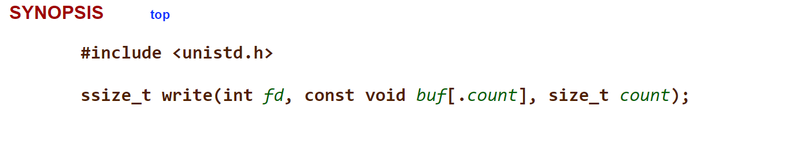

# Objective
So, this is a simple 'hello world' (or 'hello friend') in assembly. Unlike other languages, in assembly, we can grasp more concepts and understand how a machine works. I'll explain each line and why we use each command and values; some basic things I will not explain, such as the sections and some directives.

# Explanation

The first thing we need to do to print a message is define which message we will print out. In assembly, we need to:
1. Define a label;
2. Choose a directive to indicate how we will allocate the data;
3. Set the value we want to print out.

In our code, the label is `message`. The directive is `db`: **db** means: "Each character is equivalent to 1 byte", so the character 'H' in "Hello friend" is equivalent to 1 byte. There are other directives like: `dw`, `dq` and `dd` depending of which you use, each character will occupy a different space in memory. Keep in mind that when you define a label like that, it's normally used in the .data section, but I won't get into this right now.

OK! We've already defined what we will print out, now we need just print out... and how can we do this?

Let's take python3 as an example, for *writing* something in screen we can use `print('Hello Friend!')` . The function `print()` utilizes a system function(syscall) called **write**, which receives some arguments to print what is inside the brackets. We can use this syscall to print our value. As it is a function, Since it is a function, it will receive some arguments... but which ones? The [manual(man)](https://man7.org/linux/man-pages/man2/write.2.html) for write syscall says that it receives three arguments:

### First argument (`int fd`)
The first argument is a file descriptor(fd), basically this will indicate where we will write to. In our case, it will be on the screen (the standard output or simply stdout). Since it only accepts integer values, the code for stdout is **0**.

### Second argument (`const void buf[.count]`)
This one indicates what we will print out. So it will be the message label, pretty simple.

### Third Argument (`size_t count`)
Very simple too; it will tell us how much bytes we will print out, counting how many characteres 'Hello friend!' has --> 13 but other character were passed: `0xA` indicating a line break, so we want to print 14 bytes.

Awesome! With this preparation, let's return to the assembly code. The line 4,5 and 6 are standards in any assembly code, so I will not explain them. In order to use a function in assembly, it's necessary: 
1. Indicate what function we will use;
2. Tell the arguments;
3. Use the `syscall` directive to "activate" the syscall.

Let's dive into.

### 1. 'Indicate what function we will use'
In assembly, we normally indicate which syscall we will use by passing the value inside the `rax` register. It's a convention and needs to be followed. The value of a syscall is a number, and **write** syscall has the number 0, so you just need to `mov rax, 1` reading this as: move 1 to rax. Easy!

### 2. 'Tell the arguments'
Now the arguments. We already talked about them before. As a convention too, the arguments of functions/syscall can be passed in some register: rdi, rsi, rdx, r10, r8 and r9. I used rdi, rsi and rdx to handle the arguments. There's no much secrete here, we passed in *rdi* the value of **1**(stdout) representing `int fd`; in *rsi* **message** representing `const void buf[.count]` and in *rdx* the value of **14** representing `size_t count`.

### 3. 'Use the `syscall` directive to "activate" the syscall'

That's it! We've defined the code of function and its arguments, we just need to invoke `syscall` and the message *'Hello friend!'* will be printed!

### Extra
The 13, 14 and 15 is the `exit` syscall, so we can finish the execution without errors.
